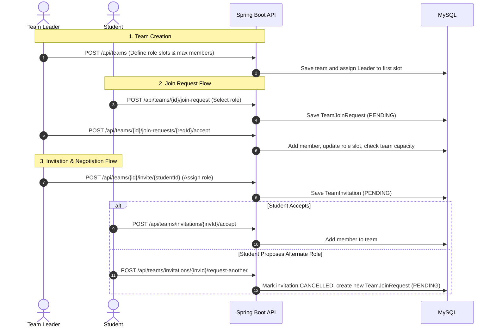

# SanGam

SanGam is a collaborative peer-discovery and team-formation platform designed for college students. It enables students to discover peers across campuses based on technical skills, academic year, and institution, while providing end-to-end tooling to create and manage teams for hackathons, capstone projects, and open-source initiatives.

[](https://san-gam.vercel.app)
[](https://sangam-backend-3p3y.onrender.com/api/health)
[](https://openjdk.org/)
[](https://spring.io/projects/spring-boot)
[](https://react.dev/)
[](https://tailwindcss.com/)
[](https://www.mysql.com/)

---

## Live Deployments

- **Web Application (Frontend):** [https://san-gam.vercel.app](https://san-gam.vercel.app)
- **REST API (Backend Health):** [https://sangam-backend-3p3y.onrender.com/api/health](https://sangam-backend-3p3y.onrender.com/api/health)

---

## Overview

College students frequently struggle to find collaborators with complementary skill sets for hackathons, course projects, and startup ideas. Traditional communication channels (e.g., campus WhatsApp groups and Discord servers) are unstructured, unsearchable, and limited in reach.

SanGam provides a structured platform where students can:
- Build comprehensive technical profiles highlighting skills, past projects, achievements, and external links (GitHub, LinkedIn, LeetCode, Portfolio).
- Discover peers using targeted filters such as college scope (**My College**, **Inter-College**, or **All Students**), academic year, and specific technical skills.
- Create project teams with defined role slots (e.g., Frontend, Backend, ML Engineer) and maximum capacity constraints.
- Send, receive, and manage team invitations and join requests with role negotiations and deadline tracking.
- Receive in-app notifications and transactional email alerts for all team-related actions.

---

## Key Features

### 1. Authentication & Account Management
- **Stateless JWT Authentication:** Secure login and registration returning JSON Web Tokens.
- **BCrypt Password Hashing:** All user passwords are encrypted before storage.
- **Email OTP Verification:** 6-digit OTP delivery powered by Brevo for account verification and password resets.
- **Self-Service Account Deletion:** Secure account deletion verified via email OTP with cascade cleanup of associated data.
- **Password Updates:** Authenticated password change with verification of the current password.

### 2. Student Profiles & Portfolio
- **Personal Details:** Manage college, branch, year of study (1st–4th), and personal bio.
- **Collaboration Preferences:** Set collaboration interests (**Looking For** options: Hackathons, College Projects, Open Source, Research, Startup, Freelance).
- **Skill Management:** Add or remove technical skills from a pre-indexed or custom list.
- **Featured Projects:** Showcase projects with titles, descriptions, tech stacks, GitHub repositories, and live demo links.
- **Achievements & Recognition:** Record hackathon wins, competition ranks, certifications, and academic milestones with proof/verification URLs.
- **External Links:** Direct links to GitHub, LinkedIn, LeetCode, portfolio sites, and custom URLs.

### 3. Peer Discovery
- **Scope-Based Filtering:**
  - `My College`: Filter peers strictly within the student's own institution.
  - `Inter-College`: Discover peers from different colleges.
  - `All Students`: Browse the global student network.
- **Attribute Filters:** Refine results by academic year (Year 1 to Year 4) and specific technology tags.

### 4. Team Creation & Management
- **Structured Role Slots:** Define exact team roles with slot counts (e.g., 2 Backend, 1 UI/UX, 1 Frontend) where the sum of slots matches total team capacity (`maxMembers`).
- **Project Details:** Add project title, vision, repository links, documentation URLs, and required skills.
- **Hackathon Integration:** Track specific hackathon names, competition URLs, and deadlines.
- **Team Leadership:** Team leaders can edit team details, extend deadlines, remove members, and manage join requests.
- **Member Self-Leave:** Team members can leave teams at any time.

### 5. Join Requests, Invitations & Role Negotiation
- **Targeted Join Requests:** Students can apply for specific open role slots or specify a custom role.
- **Direct Invitations:** Team leaders can invite registered students directly with assigned roles.
- **Role Negotiation (`request-another`):** An invited student can decline the suggested role and propose an alternate role, which cancels the invitation and generates a standard pending join request for the leader to review.
- **Capacity & Slot Enforcement:** Prevents accepting applicants or sending invitations once a specific role slot or the entire team reaches maximum capacity.
- **Automatic Request Revocation:** When a team becomes full, all remaining pending join requests and invitations are automatically revoked.

### 6. Team Deadlines & Automatic Expiry
- **Join Deadline Enforcement:** Teams can define a `joinDeadline`. Once expired, new join requests and invitations are blocked.
- **Background Cleanup:** A Spring `@Scheduled(fixedRate = 60000)` background task scans active teams every 60 seconds and marks pending requests and invitations as `EXPIRED` once the deadline has passed.
- **Deadline Extension:** Team leaders can update or extend the join deadline at any time.

### 7. Notifications & Transactional Emails
- **In-App Notification Center:** Receive real-time status alerts for received invitations, application submissions, acceptances, rejections, and revocations.
- **Transactional Emails (Brevo API):** Asynchronous email notifications sent for new team invitations, join request submissions, leader review alerts, and acceptance confirmations.

### 8. Frontend Experience & Resilience
- **Dark & Light Mode:** Theme switcher with persistent user preference.
- **Client-Side Caching & In-Flight Deduplication:** Custom caching layer on Axios GET requests to reduce network overhead.
- **Cold-Start Resilience:** Auto-retry mechanism with health-check pinging to handle server wake-ups on free-tier hosting.
- **Skeleton Loaders:** Content-specific loading states across profiles, team cards, and dashboard feeds.

---

## Tech Stack

| Layer | Technology | Purpose |
| :--- | :--- | :--- |
| **Frontend UI** | React 18, Vite | Component-based SPA build tool |
| **Routing** | React Router v6 | Client-side routing & auth route guards |
| **Styling** | Tailwind CSS, Lucide React | Utility-first styling & UI iconography |
| **HTTP Client** | Axios | REST API communication & interceptors |
| **Backend Framework**| Java 21, Spring Boot 4.1.1 | Core REST API backend |
| **Security** | Spring Security, JJWT 0.12.6 | Stateless JWT authentication & BCrypt |
| **ORM / Database** | Spring Data JPA, Hibernate, MySQL 8 | Relational data persistence & indexing |
| **Email Service** | Brevo (Sendinblue) HTTP API | Asynchronous transactional emails & OTP |
| **Testing** | JUnit 5, Mockito, Spring Boot Test, H2 | Unit and integration testing |
| **Load Testing** | k6 | Endpoint smoke and authentication load tests |
| **Deployment** | Vercel (Frontend), Render (Backend), Aiven (MySQL) | Cloud hosting & managed database |

---

## Architecture

```mermaid
graph TD
    User["Student Browser (SPA)"]
    Vercel["Frontend (Vercel)<br/>React 18 + Vite + Tailwind"]
    Render["Backend (Render)<br/>Spring Boot 4.1.1 (Java 21)"]
    MySQL["Database (Aiven Cloud)<br/>MySQL 8.x"]
    Brevo["Email Service (Brevo)<br/>REST API v3"]

    User <-->|HTTPS / Assets| Vercel
    Vercel <-->|REST API + JWT Bearer| Render
    Render <-->|JPA / Hibernate / JDBC (HikariCP)| MySQL
    Render -->|HTTP API / Async| Brevo
```

---

## Project Structure

```
SanGam/
├── Dockerfile                  # Multi-stage Docker build (Eclipse Temurin JDK/JRE 21)
├── pom.xml                     # Maven dependencies & build configuration
├── load-tests/                 # k6 load testing scripts
│   ├── smoke.js                # Health check smoke test
│   └── teams.js                # Authenticated team discovery load test
├── src/                        # Spring Boot backend source code
│   ├── main/
│   │   ├── java/com/sangam/sangam/
│   │   │   ├── config/         # Security, CORS, and diagnostic configurations
│   │   │   ├── controller/     # REST controllers (Auth, User, Team, Notification, Skill, Health)
│   │   │   ├── dto/            # Data Transfer Objects (Requests & Responses)
│   │   │   ├── entity/         # JPA Entities (User, Team, TeamMember, JoinRequest, etc.)
│   │   │   ├── repository/     # Spring Data JPA repositories
│   │   │   ├── security/       # JWT token generation, parsing, and filter chain
│   │   │   └── service/        # Business logic & email dispatch services
│   │   └── resources/
│   │       ├── application.properties  # Database, JWT, and Brevo settings
│   │       └── schema-update.sql       # Safe idempotent database migration script
│   └── test/                   # Backend unit and integration test suites
└── Frontend/                   # React SPA frontend source code
    ├── index.html              # HTML entry point
    ├── package.json            # Frontend dependencies & scripts
    ├── tailwind.config.js      # Tailwind CSS theme and color tokens
    ├── vercel.json             # Vercel SPA rewrite routing rules
    ├── vite.config.js          # Vite build config & local proxy setup
    └── src/
        ├── components/         # Reusable UI, layout, discovery, and team components
        ├── context/            # React contexts (Auth, Theme, Toast)
        ├── pages/              # Route pages (Landing, Login, Register, Teams, Profile, etc.)
        ├── routes/             # Protected and public route guards
        ├── services/           # Axios API services, interceptors, and caching layer
        └── utils/              # Constants, helpers, and validation utilities
```

---

## Authentication & Security

1. **User Registration / Login:** Users provide credentials to `/api/auth/register` or `/api/auth/login`. Passwords are validated using BCrypt.
2. **JWT Issuance:** On successful authentication, the backend signs a compact JWT containing user claims and expiration timestamps.
3. **Stateless Request Validation:** The `JwtAuthenticationFilter` intercepts incoming requests, validates the Bearer token, extracts the user principal, and sets authentication in the Spring `SecurityContextHolder`.
4. **Context-Derived Identity:** Protected endpoints derive the calling user's identity securely from `Authentication.getName()` rather than trusting client-supplied identifiers.
5. **OTP Verification:** 6-digit OTPs are stored with strict 5-minute time-to-live and a 5-attempt rate limit for account verification and password reset workflows.

---

## Team Management Workflow



---

## API Overview

### Authentication (`/api/auth`)
| Method | Endpoint | Description | Auth Required |
| :--- | :--- | :--- | :--- |
| `POST` | `/api/auth/register` | Register a new student account | No |
| `POST` | `/api/auth/login` | Authenticate student and obtain JWT token | No |
| `POST` | `/api/auth/email/send-otp` | Send verification OTP to email | No |
| `POST` | `/api/auth/email/verify-otp` | Verify 6-digit registration OTP | No |
| `POST` | `/api/auth/forgot-password/send-otp` | Send password reset OTP | No |
| `POST` | `/api/auth/forgot-password/verify-otp` | Verify password reset OTP | No |
| `POST` | `/api/auth/forgot-password/reset` | Reset account password | No |
| `POST` | `/api/auth/change-password` | Update password for authenticated user | Yes (JWT) |

### Students & Profiles (`/api/users`)
| Method | Endpoint | Description | Auth Required |
| :--- | :--- | :--- | :--- |
| `GET` | `/api/users` | Discover students (filters: `scope`, `year`, `skill`) | Optional |
| `GET` | `/api/users/{id}` | Get complete student profile by ID | Optional |
| `PUT` | `/api/users/{id}` | Update personal profile and links | Yes (JWT) |
| `GET` | `/api/users/skill/{skillId}` | Find students possessing a specific skill | Optional |
| `POST` | `/api/users/{id}/skills` | Add skill to student profile | Yes (JWT) |
| `DELETE` | `/api/users/{id}/skills/{skillName}` | Remove skill from student profile | Yes (JWT) |
| `POST` | `/api/users/{id}/projects` | Add project to portfolio | Yes (JWT) |
| `PUT` | `/api/users/{id}/projects/{projectId}` | Update project in portfolio | Yes (JWT) |
| `DELETE` | `/api/users/{id}/projects/{projectId}` | Delete project from portfolio | Yes (JWT) |
| `POST` | `/api/users/{id}/achievements` | Add achievement or award | Yes (JWT) |
| `PUT` | `/api/users/{id}/achievements/{achId}` | Update achievement details | Yes (JWT) |
| `DELETE` | `/api/users/{id}/achievements/{achId}` | Delete achievement | Yes (JWT) |
| `POST` | `/api/users/delete-account/send-otp` | Request account deletion OTP | Yes (JWT) |
| `POST` | `/api/users/delete-account/verify-and-delete` | Verify OTP and permanently delete account | Yes (JWT) |

### Teams & Collaboration (`/api/teams`)
| Method | Endpoint | Description | Auth Required |
| :--- | :--- | :--- | :--- |
| `POST` | `/api/teams` | Create a new team with role slots | Yes (JWT) |
| `GET` | `/api/teams` | List all project teams | Optional |
| `GET` | `/api/teams/{id}` | Get detailed team information | Optional |
| `PUT` | `/api/teams/{id}` | Update team details and requirements | Yes (Leader) |
| `PUT` | `/api/teams/{id}/deadline` | Update or extend team join deadline | Yes (Leader) |
| `DELETE` | `/api/teams/{id}` | Delete a team | Yes (Leader) |
| `GET` | `/api/teams/{teamId}/members` | List members of a team | Optional |
| `DELETE` | `/api/teams/{teamId}/members/{memberId}` | Remove a member from team | Yes (Leader) |
| `DELETE` | `/api/teams/{teamId}/leave` | Leave a team as a member | Yes (JWT) |
| `POST` | `/api/teams/{teamId}/join-request` | Submit a request to join a team | Yes (JWT) |
| `GET` | `/api/teams/{teamId}/join-requests` | View pending join requests | Yes (Leader) |
| `POST` | `/api/teams/{teamId}/join-requests/{reqId}/accept` | Accept a join request | Yes (Leader) |
| `POST` | `/api/teams/{teamId}/join-requests/{reqId}/reject` | Reject a join request | Yes (Leader) |
| `GET` | `/api/teams/my-join-requests` | View pending requests sent by current user | Yes (JWT) |
| `DELETE` | `/api/teams/{teamId}/join-requests/{reqId}` | Cancel a pending join request | Yes (JWT) |
| `POST` | `/api/teams/{teamId}/invite/{userId}` | Invite a student to the team | Yes (Leader) |
| `GET` | `/api/teams/{teamId}/invitations` | View invitations sent for a team | Yes (Leader) |
| `GET` | `/api/teams/invitations/my` | View invitations received by current user | Yes (JWT) |
| `POST` | `/api/teams/invitations/{invId}/accept` | Accept team invitation | Yes (JWT) |
| `POST` | `/api/teams/invitations/{invId}/reject` | Reject team invitation | Yes (JWT) |
| `POST` | `/api/teams/invitations/{invId}/request-another` | Negotiate and request an alternate role | Yes (JWT) |
| `DELETE` | `/api/teams/{teamId}/invitations/{invId}` | Cancel a sent invitation | Yes (Leader) |

### Notifications & System
| Method | Endpoint | Description | Auth Required |
| :--- | :--- | :--- | :--- |
| `GET` | `/api/notifications` | Get in-app notification inbox | Yes (JWT) |
| `POST` | `/api/notifications/{id}/read` | Mark a notification as read | Yes (JWT) |
| `DELETE` | `/api/notifications/{id}` | Delete a notification | Yes (JWT) |
| `DELETE` | `/api/notifications` | Clear all notifications | Yes (JWT) |
| `GET` | `/api/skills` | List all registered skills | Optional |
| `GET` | `/api/health` | Health check endpoint | No |

---

## Database Architecture

SanGam uses **MySQL 8.x** with JPA/Hibernate entity mappings and indexing for query performance.

### Key Entities & Relations
- **`users`**: Core user records with credentials, academic info, bio, social links, and verification status. Indexed on `(college, year)`.
- **`skills` & `user_skills`**: Many-to-many relationship mapping skills to users with Hibernate batch fetching.
- **`user_projects`**: One-to-many relationship storing portfolio project showcases and tech stacks.
- **`user_achievements`**: One-to-many relationship storing awards, contest ranks, and proof URLs.
- **`user_looking_for`**: Element collection of collaboration preferences.
- **`teams`**: Project teams with descriptions, hackathon details, join deadlines, repository links, and leader reference.
- **`team_members`**: Join table mapping team membership with `Role` (LEADER, MEMBER), `assignedRole`, and `customRole`.
- **`team_required_roles`**: Element collection maintaining required role names and allocated slot counts.
- **`team_join_requests`**: Stores student join requests with role preferences and lifecycle statuses (`PENDING`, `ACCEPTED`, `REJECTED`, `CANCELLED`, `REVOKED`, `EXPIRED`). Unique constraint on `(team_id, user_id)`.
- **`team_invitations`**: Stores team invitations sent to students with role assignments and lifecycle statuses. Unique constraint on `(team_id, invited_user_id)`.
- **`notifications`**: User notification inbox with unread tracking. Indexed on `(user_id, created_at)`.

---

## Local Development Setup

### Prerequisites
- **Java:** OpenJDK 21 or newer
- **Maven:** 3.9+ (or use the included `./mvnw` wrapper)
- **Node.js:** v18.x or v20.x and npm
- **MySQL:** 8.0+ instance running locally or via Docker

### 1. Clone Repository
```bash
git clone https://github.com/Gitey007/SanGam.git
cd SanGam
```

### 2. Backend Configuration
Set the required environment variables in your terminal or configure them in an `.env` / IDE run configuration:

```bash
export DB_URL="jdbc:mysql://localhost:3306/sangam?useSSL=false&allowPublicKeyRetrieval=true&serverTimezone=UTC"
export DB_USERNAME="your_mysql_username"
export DB_PASSWORD="your_mysql_password"
export JWT_SECRET="your_secure_random_base64_or_hex_key_at_least_256_bits_long"
export JWT_EXPIRATION="86400000"
export BREVO_API_KEY="your_brevo_api_key_here"
export BREVO_SENDER_EMAIL="notifications@yourdomain.com"
```

### 3. Run Backend
```bash
# Using the Maven wrapper
./mvnw clean spring-boot:run
```
The backend will start at `http://localhost:8080`. You can verify health at `http://localhost:8080/api/health`.

### 4. Frontend Configuration
Navigate to the `Frontend/` directory:
```bash
cd Frontend
npm install
```

Create a `.env` file in the `Frontend/` directory (optional for local dev, defaults to proxy):
```env
VITE_API_BASE_URL=http://localhost:8080
```

### 5. Run Frontend
```bash
npm run dev
```
The application will be accessible at `http://localhost:3000`.

---

## Environment Variables

| Variable | Scope | Required | Description | Example |
| :--- | :--- | :--- | :--- | :--- |
| `DB_URL` | Backend | Yes | JDBC connection string to MySQL | `jdbc:mysql://localhost:3306/sangam` |
| `DB_USERNAME` | Backend | Yes | Database username | `root` |
| `DB_PASSWORD` | Backend | Yes | Database password | `password` |
| `JWT_SECRET` | Backend | Yes | Secret key used for signing JWT tokens | `your_jwt_secret_key` |
| `JWT_EXPIRATION` | Backend | Yes | Token expiration time in milliseconds | `86400000` (24h) |
| `BREVO_API_KEY` | Backend | Optional* | Brevo REST API key for sending emails & OTP | `xkeysib-...` |
| `BREVO_SENDER_EMAIL` | Backend | Optional* | Verified sender email configured in Brevo | `no-reply@sangam.dev` |
| `PORT` | Backend | Optional | Port for Spring Boot container | `8080` |
| `VITE_API_BASE_URL` | Frontend | Optional | Base URL for API requests (empty for proxy) | `http://localhost:8080` |

*\*If Brevo credentials are not provided, email sending is safely skipped with a logged warning, allowing offline development.*

---

## Testing

### Backend Automated Tests
The repository includes unit tests and integration tests covering security, controllers, concurrent team operations, and service business logic using an embedded H2 database:

```bash
# Run all backend unit and integration tests
./mvnw clean test

# Run a specific test suite
./mvnw test -Dtest=TeamServiceTest
./mvnw test -Dtest=TeamConcurrencyIntegrationTest
```

### Frontend Build Verification
Verify that the React production bundle compiles without errors:

```bash
cd Frontend
npm run build
```

---

## Performance & Load Testing

The repository contains [k6](https://k6.io/) scripts in the `load-tests/` directory to evaluate backend responsiveness and concurrency:

```bash
# 1. Smoke test on the health endpoint
k6 run load-tests/smoke.js

# 2. Authenticated team discovery load test
K6_EMAIL="test.user@college.edu" K6_PASSWORD="your_test_password" k6 run load-tests/teams.js
```

---

## Deployment Architecture

- **Frontend (SPA):** Hosted on **Vercel**. Single-page routing is configured via `Frontend/vercel.json` rewrites.
- **Backend (REST API):** Dockerized container running on **Render**. The multi-stage `Dockerfile` uses `eclipse-temurin:21-jdk` to package the application JAR and `eclipse-temurin:21-jre` as a lightweight runtime.
- **Database:** Managed **Aiven MySQL 8.x** cluster with connection pooling configured via HikariCP in `application.properties`.

---

## Contributing

Contributions are welcome. If you would like to report a bug or suggest an improvement:

1. Fork the repository.
2. Create a feature branch (`git checkout -b feature/improvement-name`).
3. Commit your changes with descriptive messages (`git commit -m "feat: add capability"`).
4. Push to the branch (`git push origin feature/improvement-name`).
5. Open a Pull Request.

---

## Author

**Sahul Kumar**
- GitHub: [@Gitey007](https://github.com/Gitey007)
